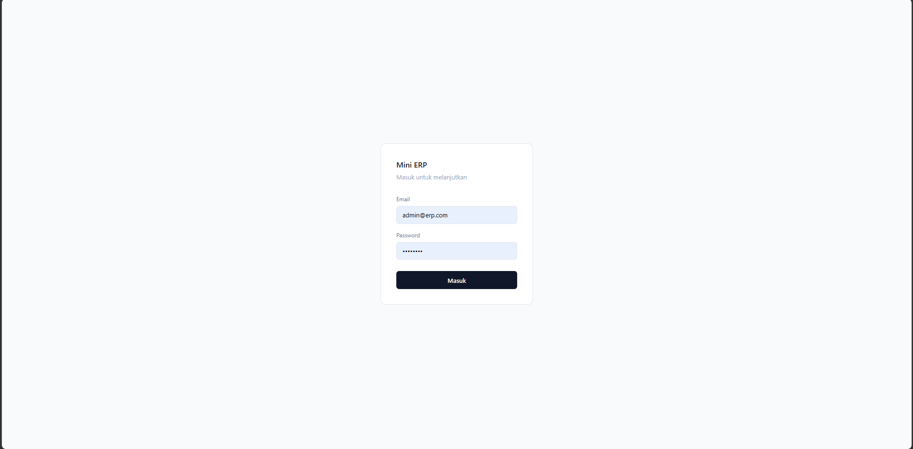
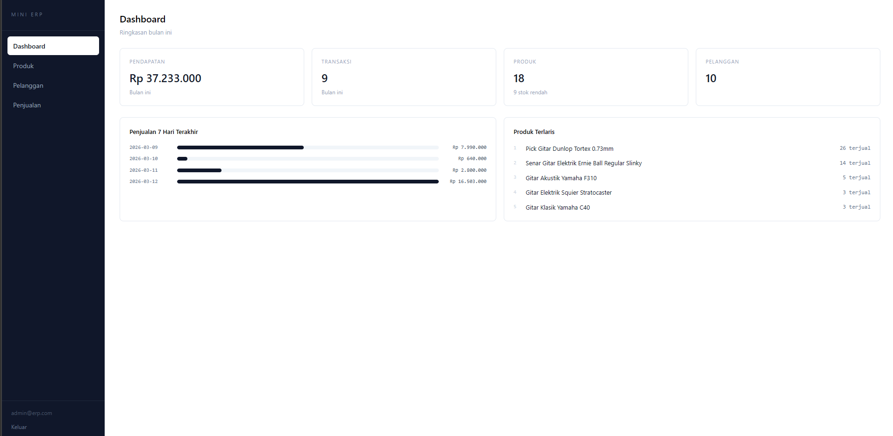
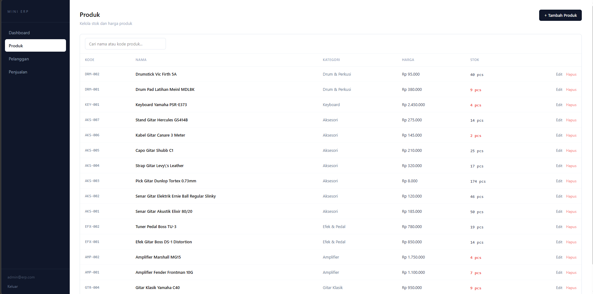
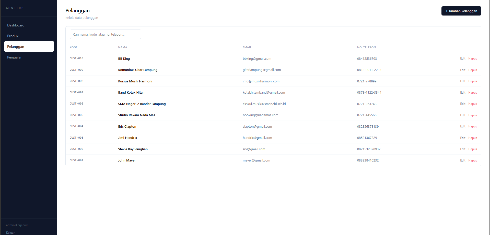
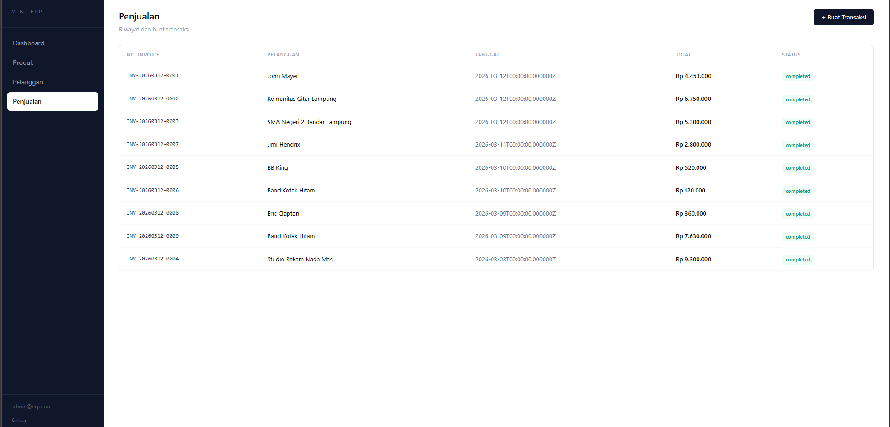

# Mini ERP

A lightweight ERP system built for small music retail businesses. Manages products, customers, and sales transactions through a clean web interface.

Built with **Laravel** · **React** · **SQLite**

---

## Screenshots

**Login**


**Dashboard**


**Products**


**Customers**


**Sales**


---

## Overview

Mini ERP provides essential business operations for a music store — from tracking instrument inventory and managing customer records to processing sales transactions and monitoring revenue through a real-time dashboard.

---

## Features

- **Authentication** — Token-based login via Laravel Sanctum
- **Product Management** — Add, edit, delete products with stock tracking and low-stock alerts
- **Customer Management** — Maintain customer records with contact details
- **Sales** — Create transactions with multiple line items; stock auto-decrements on sale
- **Dashboard** — Monthly revenue summary, 7-day sales chart, top-selling products

---

## Tech Stack

**Backend**
- Laravel 12
- Laravel Sanctum (API token authentication)
- SQLite

**Frontend**
- React 18 + Vite
- React Router DOM
- Axios
- Tailwind CSS

---

## Requirements

- PHP >= 8.2
- Composer
- Node.js >= 18
- npm

---

## Installation

### 1. Clone the repository

```bash
git clone https://github.com/username/mini-erp.git
cd mini-erp
```

### 2. Backend setup

```bash
cd backend
composer install
cp .env.example .env
php artisan key:generate
```

Ensure `.env` is configured for SQLite:

```env
DB_CONNECTION=sqlite
```

Run migrations and seed the admin user:

```bash
php artisan migrate
php artisan db:seed --class=UserSeeder
```

Start the development server:

```bash
php artisan serve
# Running at http://localhost:8000
```

### 3. Frontend setup

Open a new terminal:

```bash
cd frontend
npm install
npm run dev
# Running at http://localhost:5173
```

### 4. Access the application

Navigate to `http://localhost:5173` and log in with the default admin credentials:

```
Email    : admin@erp.com
Password : password
```

---

## Project Structure

```
mini-erp/
├── backend/
│   ├── app/
│   │   ├── Http/Controllers/
│   │   └── Models/
│   ├── database/
│   │   ├── migrations/
│   │   └── seeders/
│   └── routes/
│       └── api.php
│
└── frontend/
    └── src/
        ├── api/
        ├── components/
        ├── context/
        └── pages/
```

---

## API Reference

All endpoints except `/login` require an `Authorization: Bearer {token}` header.

| Method | Endpoint | Description |
|--------|----------|-------------|
| `POST` | `/api/login` | Authenticate and receive token |
| `POST` | `/api/logout` | Invalidate current token |
| `GET` | `/api/me` | Get authenticated user |
| `GET` | `/api/dashboard` | Dashboard summary data |
| `GET` | `/api/products` | List products (paginated, searchable) |
| `POST` | `/api/products` | Create product |
| `GET` | `/api/products/{id}` | Get product |
| `PUT` | `/api/products/{id}` | Update product |
| `DELETE` | `/api/products/{id}` | Delete product |
| `GET` | `/api/customers` | List customers (paginated, searchable) |
| `POST` | `/api/customers` | Create customer |
| `GET` | `/api/customers/{id}` | Get customer |
| `PUT` | `/api/customers/{id}` | Update customer |
| `DELETE` | `/api/customers/{id}` | Delete customer |
| `GET` | `/api/sales` | List sales transactions |
| `POST` | `/api/sales` | Create sale |
| `GET` | `/api/sales/{id}` | Get sale with line items |

---

## License

This project is open source and available under the [MIT License](LICENSE).
